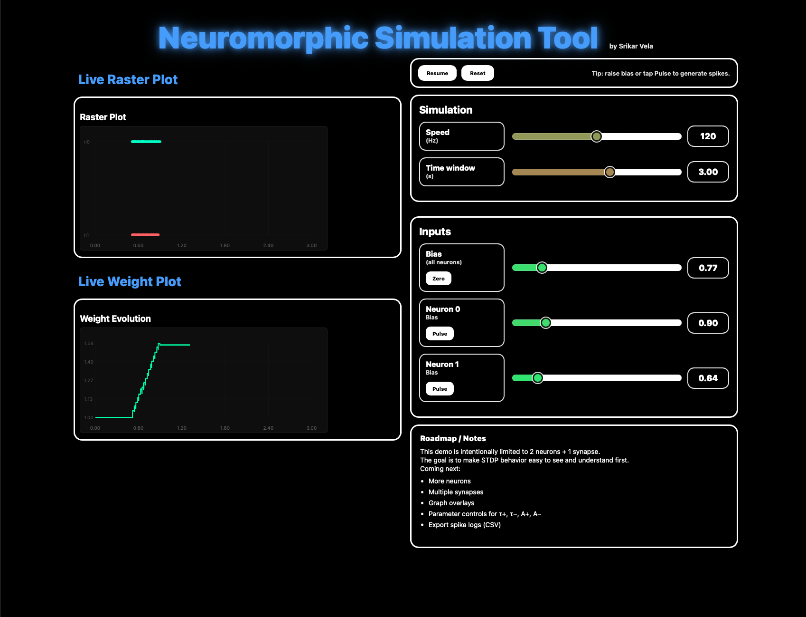

<p align="center">
  
</p>

# Neuromorphic Web Simulator

A browser-based neuromorphic simulation tool that visualizes spiking neural dynamics and synaptic plasticity in real time.

This project combines a **TypeScript-based neuromorphic simulation engine** with a **React + WebWorker front-end**, allowing users to explore spiking behavior, raster plots, and synaptic weight evolution interactively.

---

## 🧠 Concept & Purpose

This simulator is intentionally designed as a **conceptual representation of neuromorphic learning dynamics**, not a large-scale biological model or production neural framework.

The current implementation focuses on:
- Making spike timing behavior visually intuitive
- Demonstrating STDP (Spike-Timing Dependent Plasticity)
- Showing how causal spike relationships modify synaptic weights
- Building clean architectural separation between UI and engine

The goal is to provide a **clear, inspectable, educational platform** for understanding how spiking systems learn — rather than maximizing biological realism or network scale.

---

## 🚧 Project Status

**Current version:** `v0.1-ui-pipeline`

This checkpoint emphasizes:
- Infrastructure
- Architecture
- Real-time UI ↔ simulation data flow

✔ Core simulation engine implemented  
✔ WebWorker-based simulation loop  
✔ React UI pipeline wired end-to-end  
✔ Live raster & weight plotting  
✔ Interactive bias + pulse controls  
❌ Multi-neuron networks (planned)  
❌ Multi-synapse topologies (planned)  
❌ Advanced parameter tuning (planned)

---

## 📸 STDP Demonstration

Below is a sample run showing **causal spike timing leading to synaptic potentiation**:

<p align="center">
  
</p>

In this configuration:
- Neuron 0 spikes first (pre-synaptic)
- Neuron 1 spikes shortly after (post-synaptic)
- Δt = t_post − t_pre > 0
- STDP applies positive weight updates
- The synaptic weight increases stepwise and stabilizes

This demonstrates classical Hebbian causality in a minimal 2-neuron system.

---

## 🧠 Architecture Overview

```
┌────────────┐        messages        ┌────────────────────┐
│  React UI  │  <------------------>  │  Simulator Worker   │
│            │                        │  (WebWorker)        │
│ RasterPlot │                        │  Time stepping      │
│ WeightPlot │                        │  STDP updates       │
└────────────┘                        └──────────┬─────────┘
                                                 │
                                      ┌──────────▼─────────┐
                                      │ Neuromorphic Engine │
                                      │  • LIF Neurons     │
                                      │  • Synapses        │
                                      │  • STDP Learning   │
                                      └────────────────────┘
```

The simulation runs **off the main UI thread**, ensuring smooth visualization even as complexity increases.

---

## ⚙️ Core Features

### Simulation Engine (TypeScript)
- Leaky Integrate-and-Fire (LIF) neuron model
- Synapse abstraction with dynamic weights
- STDP learning rule implementation
- Deterministic time stepping
- Standalone Node-based test harness

### Frontend (React + Vite)
- Live raster plot visualization
- Live synaptic weight tracking
- WebWorker-based simulation execution
- Pause / resume / restart controls
- Real-time bias and pulse injection
- Modular architecture for future scaling

---

## ▶️ Running the Project

```bash
npm install
npm run dev
```

Then open:

```
http://localhost:5173
```

---

## 🧪 Engine Validation

The neuromorphic engine can be tested independently:

```bash
node --loader ts-node/esm engine/simulation/testHarness.ts
```

This validates:
- Stable neuron dynamics
- Correct spike emission
- Proper STDP weight updates

---

## 🧭 How to Use the Simulator

1. Click **Reset** to initialize the system.
2. Set **Speed (Hz)** and **Time Window**.
3. Keep global bias near zero for clean experiments.
4. Increase bias slightly on Neuron 0.
5. Click **Pulse** repeatedly on Neuron 0.
6. Observe:
   - Raster spikes (top plot)
   - Weight staircase behavior (bottom plot)

To observe potentiation:
- Ensure pre-synaptic neuron spikes slightly before post-synaptic neuron.

To experiment:
- Adjust biases
- Change timing patterns
- Compare weight evolution

---

## 🔮 Roadmap

This demo is intentionally limited to **2 neurons + 1 synapse**.

The purpose of this constraint is clarity — making learning dynamics easy to see and reason about.

Planned future expansions:

- Multi-neuron networks
- Multiple synapses
- Parameter controls for τ+, τ−, A+, A−
- Graph overlays
- Interactive network diagram
- Exportable spike logs (CSV)
- User-adjustable neuron thresholds and time constants

As the model evolves, the UI will expand alongside a deeper understanding of neuromorphic behavior and learning mechanisms.

---

## 🎯 Motivation

This project aims to provide:
- Intuition for spiking neural systems
- Clear visualization of plasticity mechanisms
- A clean, extensible architecture for experimentation

It is designed to be:
- Educational
- Experimental
- Architecturally scalable

---

## 📁 Repository Structure

```
neuromorphic-web-simulator/
├── engine/
│   ├── core/
│   ├── learning/
│   ├── network/
│   └── simulation/
│
├── frontend/
│   ├── components/
│   ├── hooks/
│   └── workers/
│
├── docs/
│   ├── previews/
│   └── README_IMGS/
│
├── public/
├── tsconfig.json
├── vite.config.ts
└── package.json
```

---

## 📜 License

MIT License (planned)

```